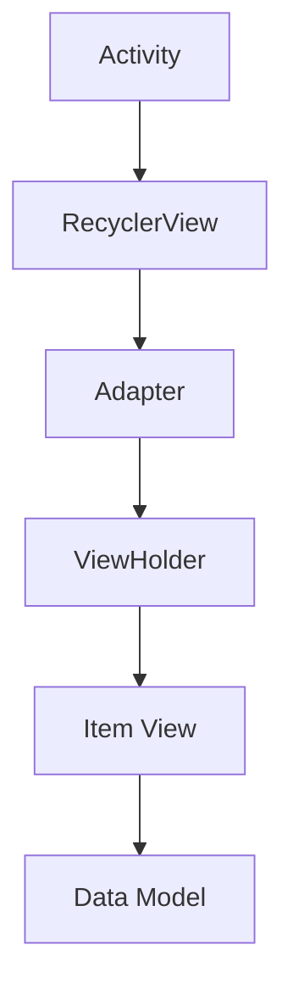

# Energy App

Welcome to Energy App! This application is designed to provide users with information about various exercises and actions to help them maintain a healthy lifestyle. Whether you're a beginner or an experienced fitness enthusiast, Energy App has something for everyone.

## Table of Contents

1. [Introduction](#introduction)
2. [Features](#features)
3. [How to Use](#how-to-use)
4. [Project Structure](#project-structure)
5. [Technical Details](#technical-details)
6. [Contributing](#contributing)
7. [License](#license)

## Introduction

Energy App is an Android application developed to assist users in their fitness journey by providing detailed information about different exercises and actions. The app aims to educate users about proper workout techniques and help them achieve their fitness goals.

## Features

- **Exercise Information**: Browse through a variety of exercises categorized by body parts.
- **Action Details**: View detailed instructions and descriptions for each exercise action.
- **Customizable Settings**: Adjust font size and other settings according to personal preferences.
- **Sleek Design**: Enjoy a modern and intuitive user interface for seamless navigation.
- **Search**:  You can search for every action you need to find in this app.

## How to Use

To use Energy App, follow these simple steps:

1. **Installation**: Download and install the Android studio with the required SDK version.
2. **Launching**: Build the project and wait for launch the application in the emulator or your real android device.
3. **Navigation**: Upon launching the app, you'll be greeted with the splash screen followed by the main screen displaying various exercises.
4. **Exploration**: Tap on any exercise to view detailed actions associated with it.
5. **Settings**: Customize the app settings by accessing the Settings page from the navigation drawer.
6. **About Us**: Learn more about the Energy App and its developers by visiting the About Us page.

### Requirements

- Android device running Android 7.0 (Nougat) or above.
- Minimum SDK version: 27
- Target SDK version: 34

## Project Structure

The project structure is organized as follows:

```
energy/
|-- app/
|   |-- src/
|       |-- main/
|           |-- java/
|               |-- app.emran.energy/
|                   |-- activities/
|                   |-- adapters/
|                   |-- data/
|                   |-- models/
|           |-- res/
|               |-- layout/
|               |-- values/
|               |-- drawable/
|               |-- ...
|-- build.gradle
|-- AndroidManifest.xml
|-- README.md
```

- **activities**: Contains all activity classes responsible for various screens in the app.
- **adapters**: Houses RecyclerView adapters for displaying data.
- **data**: Holds data-related classes such as constants and data models.
- **models**: Contains POJO (Plain Old Java Object) classes representing data entities.
- **layout**: XML layout files for defining the UI of each screen.
- **values**: Resource files including strings, colors, and dimensions.

## Technical Details

### Architecture

Energy App follows the Model-View-ViewModel (MVVM) architecture pattern for separation of concerns and efficient data management.

### RecyclerView

The main screen utilizes a RecyclerView to display a list of exercises. Each exercise item is populated dynamically using an adapter.



### Splash Screen

A splash screen is implemented to provide users with a smooth transition when launching the app.

### Customization

Users can customize the font size and other settings through the Settings page accessible from the navigation drawer.

## Contributing

We welcome contributions from the community! If you'd like to contribute to Energy App, please follow these steps:

1. Fork the repository.
2. Create a new branch for your feature or bug fix.
3. Make your changes and submit a pull request.

## License

Energy App is licensed under the MIT License. See the [LICENSE](LICENSE) file for more details.

---

Thank you for choosing Emran Hejazi to develop this app! I hope you have a really good presentation for this app. If you have any questions or feedback, please don't hesitate to reach out to me.

**Developed by the Emran Hejazi**
